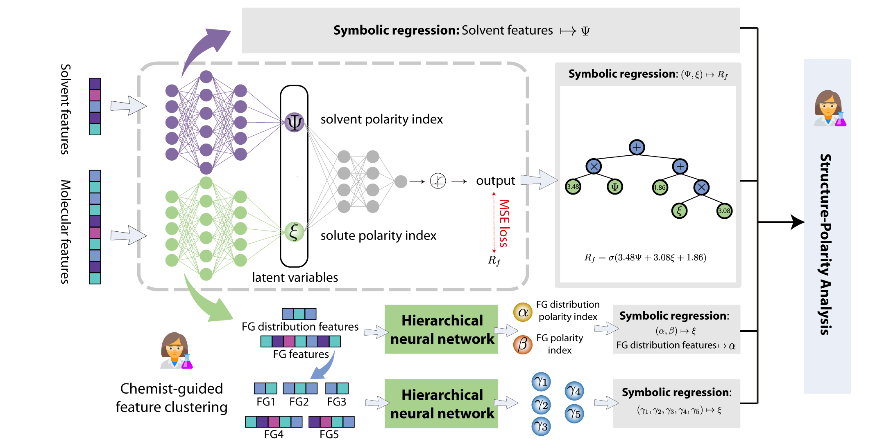

# UnsupervisedHierarchicalSymbolicRegression
This is the repository for paper  ["Empowering Machines to Think Like Chemists: Unveiling Molecular Structure-Polarity Relationships with Hierarchical Symbolic Regression"](https://arxiv.org/abs/2401.13904).



## Getting Started 

```
conda create -n UHiSR python=3.8
conda activate UHiSR
pip install -r requirements.txt
```


## Training Hierarchical Neural Networks

To obtain polarity indices, can run below code. There will be three set of polarity indices learned: (Solvent polarity index, solute polarity index), (FG distribution polarity index, FG polarity index), (FG_1, FG_2, FG_3, FG_4, FG_5)

```
python train.py
```

The results will be saved under `./result`

## Running symbolic regression

For each submodel, we run symbolic regression to obtain the mathematical formula, e.g. $(\Psi, \xi) \mapsto R_f$.
```
cd pySR
python train_pysr_final.py # to run the R_f governing equation
```

*open source python package PySR:https://github.com/MilesCranmer/PySR is employed in the study, please follow the repository to install PySR.
